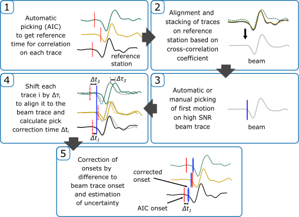

# Pick-Correlation Correction

## Introduction
Currently, the pick-correlation correction algorithm is not accessible from they PyLoT GUI. The main file *pick_correlation_correction.py* is located in the directory *pylot\correlation*.
The program only works for an obspy dmt database structure.

The basic workflow of the algorithm is shown in the following diagram. The first step **(1)** is the normal (automatic) picking procedure in PyLoT. Everything from step **(2)** to **(5)** is part of the correlation correction algorithm.

*Note: The first step is not required in case theoretical onsets are used instead of external picks when the parameter use_taupy_onsets is set to True. However, an existing event quakeML (.xml) file generated by PyLoT might be required for each event in case not external picks are used.*



A detailed description of the algorithm can be found in the corresponding publication:

*Paffrath, M., Friederich, W., and the AlpArray and AlpArray-SWATH D Working Groups: Teleseismic P waves at the AlpArray seismic network: wave fronts, absolute travel times and travel-time residuals, Solid Earth, 12, 1635–1660, https://doi.org/10.5194/se-12-1635-2021, 2021.*

## How to use
To use the program you have to call the main program providing two mandatory arguments: a path to the obspy dmt database folder *dmt_database_path* and the path to the PyLoT infile *pylot.in* for picking of the beam trace:

```python pick_correlation_correction.py dmt_database_path pylot.in```

By default, the parameter file *parameters.yaml* is used. You can use the command line option *--params* to specify a different parameter file and other optional arguments such as *-pd* for plotting detailed information or *-n 4* to use 4 cores for parallel processing:

```python pick_correlation_correction.py dmt_database_path pylot.in --params parameters_adriaarray.yaml -pd -n 4```

## Cross-Correlation Parameters

The program uses the parameters in the file *parameters.yaml* by default. You can use the command line option *--params* to specify a different parameter file. An example of the parameter file is provided in the *correlation\parameters.yaml* file.

In the top level of the parameter file the logging level *logging* can be set, as well as a list of pick phases *pick_phases* (e.g. ['P', 'S']).

For each pick phase the different parameters can be set in the first sub-level of the parameter file, e.g.:

```yaml
logging: info
pick_phases: ['P', 'S']

P:
 min_corr_stacking: 0.8
 min_corr_export: 0.6
 [...]

S:
 min_corr_stacking: 0.7
 [...]
```

The following parameters are available:


| Parameter Name                 | Description                                                                                        | Parameter Type |
|--------------------------------|----------------------------------------------------------------------------------------------------|----------------|
| min_corr_stacking              | Minimum correlation coefficient for building beam trace                                            | float          |
| min_corr_export                | Minimum correlation coefficient for pick export                                                    | float          |
| min_stack                      | Minimum number of stations for building beam trace                                                 | int            |
| t_before                       | Correlation window before reference pick                                                           | float          |
| t_after                        | Correlation window after reference pick                                                            | float          |
| cc_maxlag                      | Maximum shift for initial correlation                                                              | float          |
| cc_maxlag2                     | Maximum shift for second (final) correlation (also for calculating pick uncertainty)               | float          |
| initial_pick_outlier_threshold | Threshold for excluding large outliers of initial (AIC) picks                                      | float          |
| export_threshold               | Automatically exclude all onsets which deviate more than this threshold from corrected taup onsets | float          |
| min_picks_export               | Minimum number of correlated picks for export                                                      | int            |
| min_picks_autopylot            | Minimum number of reference auto picks to continue with event                                      | int            |
| check_RMS                      | Do RMS check to search for restitution errors (very experimental)                                  | bool           |
| use_taupy_onsets               | Use taupy onsets as reference picks instead of external picks                                      | bool           |
| station_list                   | Use the following stations as reference for stacking                                               | list[str]      |
| use_stacked_trace              | Use existing stacked trace if found (spare re-computation)                                         | bool           |
| data_dir                       | obspyDMT data subdirectory (e.g. 'raw', 'processed')                                               | str            |
| pickfile_extension             | Use quakeML files (PyLoT output) with the following extension                                      | str            |
| dt_stacking                    | Time difference for stacking window (in seconds)                                                   | list[float]    |
| filter_options                 | Filter for first correlation (rough)                                                               | dict           |
| filter_options_final           | Filter for second correlation (fine)                                                               | dict           |
| filter_type                    | Filter type (e.g. bandpass)                                                                        | str            |
| sampfreq                       | Sampling frequency (in Hz)                                                                         | float          |

## Example Dataset
An example dataset with waveform data, metadata and automatic picks in the obspy-dmt dataset format for testing can be found at https://zenodo.org/doi/10.5281/zenodo.13759803