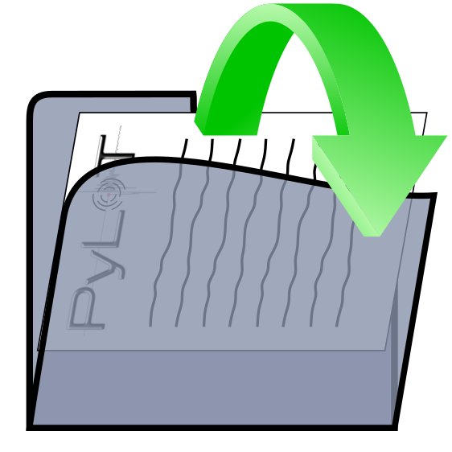
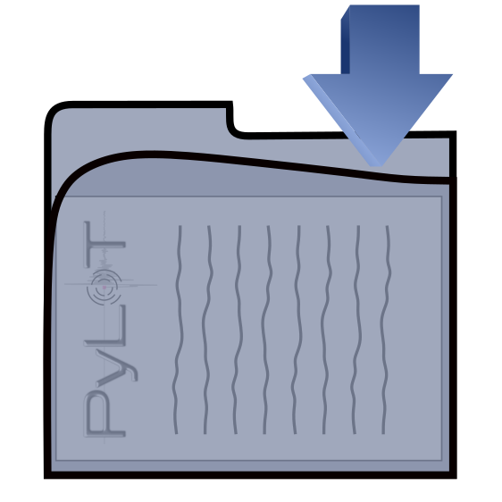
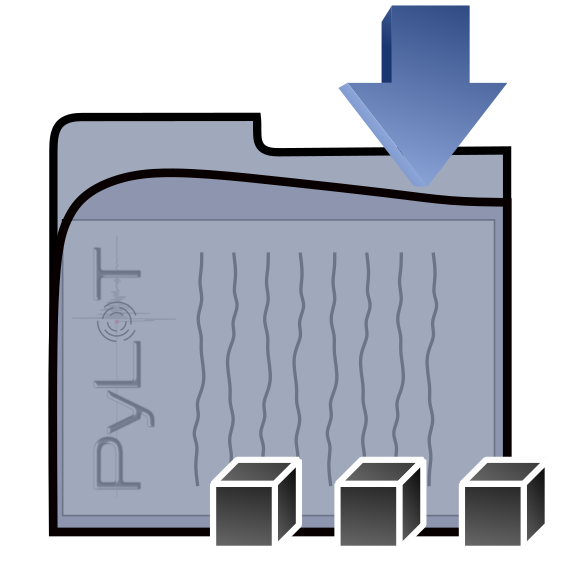
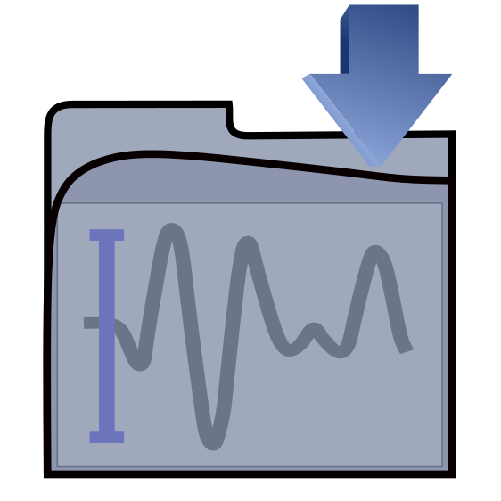
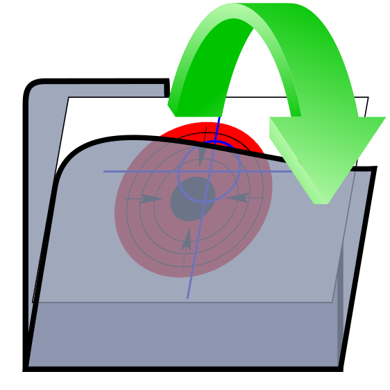
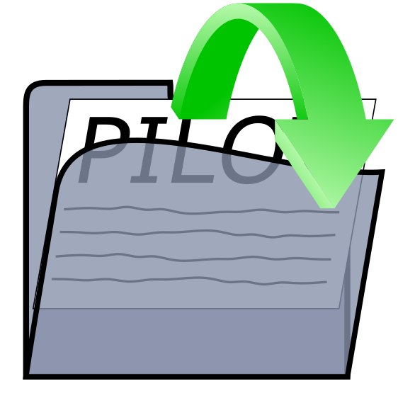

# PyLoT Documentation

- [PyLoT Documentation](#pylot-documentation)
- [PyLoT GUI](#pylot-gui)
  - [First start](#first-start)
  - [Main Screen](#main-screen)
    - [Waveform Plot](#waveform-plot)
      - [Mouse view controls :](#mouse-view-controls)
      - [Buttons](#buttons)
    - [Array Map](#array-map)
    - [Eventlist](#eventlist)
  - [Usage](#usage)
    - [Projects and Events](#projects-and-events)
    - [Event folder structure](#event-folder-structure)
    - [Adding events to project](#adding-events-to-project)
    - [Saving projects](#saving-projects)
    - [Adding metadata](#adding-metadata)
- [Picking](#picking)
  - [Manual Picking](#manual-picking)
    - [Picking window](#picking-window)
      - [Picking Window Settings](#picking-window-settings)
    - [Filtering](#filtering)
    - [Export and Import of manual picks](#export-and-import-of-manual-picks)
      - [Export](#export)
      - [Import](#import)
  - [Automatic Picking](#automatic-picking)
    - [Tuning](#tuning)
    - [Production run of the autopicker](#production-run-of-the-autopicker)
    - [Evaluation of automatic picks](#evaluation-of-automatic-picks)
      - [1. Jackknife check](#1-jackknife-check)
      - [2. Wadati check](#2-wadati-check)
    - [Comparison between automatic and manual picks](#comparison-between-automatic-and-manual-picks)
    - [Export and Import of automatic picks](#export-and-import-of-automatic-picks)
- [FAQ](#faq)

# PyLoT GUI

This section describes how to use PyLoT graphically to view waveforms and create manual or automatic picks.

## First start

After opening PyLoT for the first time, the setup routine asks for the following information:

Questions:
1. Full Name
2. Authority: Enter authority/instituiton name
3. Format: Enter output format (*.xml, *.cnv, *.obs)

TODO: explain what these things mean, where they are used

## Main Screen

After entering the [information](#first-start), PyLoTs main window is shown. It defaults to a view of the [Waveform Plot](#waveform-plot), which starts empty.

Add trace data by [loading a project](#projects-and-events) or by [adding event data](#adding-events-to-project).

### Waveform Plot

The waveform plot shows a trace list of all stations of an event.   
Click on any trace to open the stations [picking window](#picking-window), where you can review automatic and manual picks.

In the bottom bar information about the trace under the mouse cursor is shown. This information includes the station name (station), the absolute UTC time (T) of the point under the mouse cursor and the relative time since the first trace start in seconds (t) as well as a trace count.

#### Mouse view controls : 

Hold left mouse button and drag to pan view.

Hold right mouse button and
Direction | Result
--- | ---
Move the mouse up | Increase amplitude scale
Move the mouse down | Decrease amplitude scale
Move the mouse right | Increase time scale
Move the mouse left | Decrease time scale

Press right mouse button and click "View All" from the context menu to reset the view.

#### Buttons

Icon &nbsp; &nbsp; &nbsp; &nbsp; &nbsp; &nbsp; &nbsp; &nbsp; &nbsp; &nbsp; &nbsp; &nbsp; &nbsp; &nbsp; &nbsp; &nbsp; &nbsp; &nbsp; &nbsp;&nbsp; &nbsp; &nbsp; &nbsp; &nbsp; &nbsp; | Description
--- | ---
 | Create a new project, for more information about projects see [Projects and Events](#projects-and-events).
 | Load a project file from disk.
 | Save all current events into an associated project file on disk. If there is no project file currently associated, you will be asked to create a new one.
 | Save all current events into a new project file on disk. See [Saving projects](#saving-projects).
 | Add event data by selecting directories containing waveforms. For more information see [Event folder structure](#event-folder-structure).
 | Load picks/origins from disk into the currently displayed event. If a pick already exists for a station, the one from file will overwrite the existing one.
 | Load picks/origins for all events of the current project. PyLoT searches for files within the directory of the event and tries to load them for that event. For this function to work, the files containing picks/origins have to be named as described in [Event folder   structure](#event-folder-structure). If a pick already exists for a station, the one from file will overwrite the existing one.
 | Save event information such as picks and origin to file. You will be asked to select a directory in which this information should be saved.
 | 
 | Load event information from a previous, MatLab based PILOT version.
 | Display Z component of streams in waveform plot.
 | Display N component of streams in waveform plot.
 | Display E component of streams in waveform plot.
 | Open the [Tune Autopicker window](#tuning).
 | Opens a window that allows starting the autopicker for all events ([Production run of the AutoPicker](#production-run-of-the-autopicker)).
 | Compare automatic and manual picks, only available if automatic and manual picks for an event exist. See [Comparison between automatic and manual picks](#comparison-between-automatic-and-manual-picks).
 | Run a location routine (NonLinLoc) as configured in the settings on the picks.

### Array Map

The array map will display a color diagram to allow a visual check of the consistency of picks across multiple stations. This works by calculating the time difference of every onset to the earliest onset. Then isolines are drawn between stations with the same time difference and the areas between isolines are colored.  
The result should resemble a color gradient as the wavefront rolls over the network area. Stations where picks are earlier/later than their neighbours can be reviewed by clicking on them, which opens the picking window.

Above the Array Map the picks that are used to create the map can be customized.
The phase of picks that should be used can be selected, which allows checking the consistency of the P- and S-phase seperately.
Additionally the pick type can be set to manual, automatic or hybrid, meaning display only manual picks, automatic picks or only display automatic picks for stations where there are no manual ones.

*Array Map for an event at the Northern Mid Atlantic Ridge, between North Africa and Mexico (Lat. 22.58, Lon. -45.11). The wavefront moved from west to east over the network area (Alps and Balcan region), with the earliest onsets in blue in the west.*

To be able to display an array map PyLoT needs to load an inventory file, where the metadata of seismic stations is kept. For more information see [Metadata](#adding-metadata). Additionally automatic or manual picks need to be loaded for the current event.

### Eventlist

The eventlist displays event parameters. The displayed parameters are saved in the .xml file in the event folder. Events can be deleted from the project by pressing the red X in the leftmost column of the corresponding event.

## Usage

### Projects and Events

PyLoT uses projects to categorize different seismic data. A project consists of one or multiple events. Events contain seismic traces from one or multiple stations. An event also contains further information, e.g. origin time, source parameters and automatic and manual picks.
Projects are used to group events which should be analyzed together. A project could contain all events from a specific region within a timeframe of interest or all recorded events of a seismological experiment.

### Event folder structure

PyLoT expects the following folder structure for seismic data:
* Every event should be in it's own folder with the following naming scheme for the folders:
   ``e[id].[doy].[yy]``, where ``[id]`` is a four-digit numerical id increasing from 0001, ``[doy]`` the three digit day of year and ``[yy]`` the last two digits of the year of the event. This structure has to be created by the user of PyLoT manually.
* These folders should contain the seismic data for their event as ``.mseed`` or other supported filetype TODO: LINK HERE
* All automatic and manual picks should be in an ``.xml`` file in their event folder. PyLoT saves picks in this file. This file does not have to be added manually unless there are picks to be imported. The format used to save picks is QUAKEML.   
Picks are saved in a file with the same filename as the event folder with ``PyLoT_`` prepended.
* The file ``notes.txt`` is used for saving analysts comments. Everything saved here will be displayed in the 'Notes' column of the eventlist.

### Adding events to project

PyLoT GUI starts with an empty project. To add events, use the add event data button. Select one or multiple folders containing events. 

TODO: explain _Directories: Root path, Data path, Database path_

### Saving projects

Save the current project from the menu with File->Save project or File->Save project as.
PyLoT uses ``.plp`` files to save project information. This file format is not interchangable between different versions of Python interpreters.
Saved projects contain the automatic and manual picks. Seismic trace data is not included into the ``.plp`` file, but read from its location used when saving the file.

### Adding metadata

TODO: Add picture of metadata "manager" when it is done

PyLoT can handle ``.dless``, ``.xml``, ``.resp`` and ``.dseed`` file formats for Metada. Metadata files stored on disk can be added to a project by clicking *Edit*->*Manage Inventories*. This opens up a window where the folders that contain metadata files can be selected. PyLoT will then search these files for the station names when it needs the information.

# Picking

PyLoTs automatic and manual pick determination works as following:
* Using certain parameters, a first initial/coarse pick is determined. The first manual pick is determined by visual review of the whole waveform and selection of the most likely onset by the analyst. The first automatic pick is determined by calculation of a characteristic function (CF) for the seismic trace. When a wave arrives, the CFs properties change, which is determined as the signals onset.
* Afterwards, a refined set of parameters is applied to a small part of the waveform around the initial onset. For manual picks this means a closer view of the trace, for automatic picks this is done by a recalculated CF with different parameters.
* This second picking phase results in the precise pick, which is treated as the onset time.

## Manual Picking

To create manual picks, you will need to open or create a project that contains seismic trace data (see [Adding events to projects](#adding-events-to-project)). Click on a trace to open the [Picking window](#picking-window).

### Picking window

Open the picking window of a station by leftclicking on any trace in the waveform plot. Here you can create manual picks for the selected station. 

#### Picking Window Settings

Icon | Shortcut | Menu Alternative | Description
---|---|---|---
 | 1 or p | Filter->Apply P Filter | Filter all channels according to the options specified in Filter parameter, P Filter section.
 | 5 or s | Filter->Apply S Filter | Filter all channels according to the options specified in Filter parameter, S Filter section.
 | Ctrl + a | Filter->Automatic Filtering | Select the correct filter option (P, S) depending on the selected phase to be picked.
 | 1 or 5 | Picks->P or S | Select phase to pick.
 | - | - | Zoom into waveform.
 | - | - | Reset zoom to default view.
 | - | - | Delete all manual picks on this station.
 | - | - | Click this button and then the picked phase to rename it.
 | - | - | If checked, after accepting the manual picks for this station with 'OK', the picking window for the next station will be opened. This option is useful for fast manual picking of a complete event.
Estimated onsets | - | - | Show the theoretical onsets for this station. Needs metadata and origin information.
Compare to channel | - | - | Select a data channel to compare against. The selected channel will be displayed in the picking window behind every channel to compare signal correlation.
Scale by | - | - | Normalized means every channel is scaled to it maximum seperately. If a channel is selected here, all channels will be scaled with regards to this channel.
 
Menu Command | Shortcut | Description
---|---|---
P Channels and S Channels | - | Select which channels should be treated as P or S channels during picking. When picking a phase, only the corresponding channels will be shown during the precise pick

TODO: is the above table done?

### Filtering

Access the Filter options by pressing Ctrl+f on the Waveform plot or by the menu under *Edit*->*Filter Parameter*.

 Here you are able to select filter type, order and frequencies for the P and S pick seperately. These settings are used in the GUI for filtering for displaying the waveform data and during manual picking. The values used by PyLoT for automatic picking are displayed next to the manual values. They can be changed in the [Tune Autopicker dialog](#tuning).  
 A green value automatic value means the automatic and manual filter parameter is configured the same, read means they are configured differently.
By toggling the "Overwrite filteroptions" checkmark you can set whether the manual precise/second pick uses the filter settings for the automatic picker (unchecked) or whether it uses the filter options in this dialog (checked).
To guarantee consistent picking results between automatic and manual picking it is recommended to use the same fiter settings for the determination of automatic and manual picks.

### Export and Import of manual picks

#### Export

After the creation of manual picks they can either be save in the project file (see [Saving projects](#saving-projects)). Alternatively the picks can be exported by pressing the  button above the waveform plot or in the menu File->Save event information (shortcut Ctrl+p). Select the event directory in which to save the file. The filename will be ``PyLoT_[event_folder_name].[filetype selected during first startup]``. TODO: Is the filetype during first startup selected for saving files?

You can rename and copy this file, but PyLoT will then no longer be able to automatically recognize the correct picks for an event and the file will have to be manually selected when loading. 

#### Import

To import previously saved picks press the  button and select the file to load. You are asked to save the current state of your current project if you have not done so before. You can continue without saving by pressing "Discard".
 PyLoT will automaticall load files named after the scheme it uses when saving picks, described in the paragraph above. If it cant file any aptly named files, a file dialog will open and you can select the file you wish to load. 

If you see a warning "Mismatch in event identifiers" and are asked whether to continue loading the picks, this means that PyLoT doesn't recognize the picks in the file as belonging to this specific event. They could have either been saved under a different installation of PyLoT but with the same waveform data, which means they are still compatible and you can continue loading them. Or they could be picks from a different event, in which case loading them is not reccommended. 

## Automatic Picking

The general workflow for automatic picking is as following:
- After setting up the project by loading waveforms and metadata, the right parameters for the autopicker have to be determined
- This [tuning](#tuning) is done for single stations with immediate graphical feedback of all picking results
- Afterwards the autopicker can be run for all or a subset of events from the project

For automatic picking PyLoT discerns between tune and test events, which the user has to set as such. Tune events are used to calibrate the autopicking algorithm, test events are then used to test the calibration. The purpose of that is controlling whether the parameters found during tuning are able to reliably pick the "unknown" test events.  
If this behaviour is not desired and all events should be handled the same, dont mark any events. Since this is just a way to group events to compare the picking results, nothing else will change.

### Tuning

Tuning describes the process of adjusting the autopicker settings to the characteristics of your data set. To do this in PyLoT, use the  button to open the Tune Autopicker. 

View of a station in the Tune Autopicker window. 
1. Select the event to be displayed and processed.
2. Select the station from the event. 
3. To pick the currently displayed trace, click the  button.
4. These tabs are used to select the current view. __Traces Plot__ contains a plot of the stations traces, where manual picks can be created/edited. __Overview__ contains graphical results of the automatic picking process. The __P and S tabs__ contain the automatic picking results of the P and S phase, while __log__ contains a useful text output of automatic picking.
5. These buttons are used to load/save/reset settings for automatic picking. The parameters can be saved in PyLoT input files, which have the file ending *.in*. They are human readable text files, which can also be edited by hand. Saving the parameters allows you to load them again later, even on different machines.
6. These menus control the behaviour of the creation of manual picks from the Tune Autopicker window. Picks allows to select the phase for which a manual pick should be created, Filter allows to filter waveforms and edit the filter parameters. P-Channels and S-Channels allow to select the channels that should be displayed when creating a manual P or S pick. 
7. The first two buttons toggle wether the waveforms should be displayed filtered with the settings for manual P and S picks respectively. The next button toggles whether selecting a phase to pick also filters the waveform with the parameters for that phase.   
The next two buttons, __P__ and __S__ select the phase for manual picking. Then two buttons that control the zoom level follow. After that, the __red X__ button deletes all picks from this station. The green button to the right allows to rename a pick phase.  
The __Manual Onsets__ accepts or reject the manual picks created in the Tune Autopicker window, pressing accept adds them to the manual picks for the event, while reject removes them.   
When metadata is available for a station/event, the __Estimated Onsets__ plots theoretical arrival times.   
The __Compare to channel__ allows to select a channel, whose traces are then displayed in the same plot as the other channels. TODO: What is that good for?   
___Scaling__ allows select a trace to which all other values are scaled. By default every trace is scaled to its own maximum, but with this selection every trace will be scaled relatively to the selected trace.
8. The traces plot in the center allows creating manual picks and viewing the waveforms.
9. The parameters which influence the autopicking result are in the Main settings and Advanced settings tabs on the left side. For a description of all the parameters see the [tuning documentation](tuning.md).

### Production run of the autopicker

After the settings used during tuning give the desired results, the autopicker can be used on the complete dataset. To invoke the autopicker on the whole set of events, click the  button.

### Evaluation of automatic picks

PyLoT has to internal consistency checks for automatic picks that were determined for an event:
1. Jackknife check
2. Wadati check

#### 1. Jackknife check

The jackknife test in PyLoT checks the consistency of automatically determined P-picks by checking the statistical variance of the picks. The variance of all P-picks is calculated and compared to the variance of subsets, in which one pick is removed.   
The idea is, that picks that are close together in time should not influence the estimation of the variance much, while picks whose positions deviates from the norm influence the variance to a greater extent. If the estimated variance of a subset with a pick removed differs to much from the estimated variance of all picks, the pick that was removed from the subset will be marked as invalid.   
The factor by which picks are allowed to skew from the estimation of variance can be configured, it is called *jackfactor*, see [here](tuning.md#Pick-quality-control).

Additionally, the deviation of picks from the median is checked. The median of all P-picks that passed the Jackknife test is calculated. Picks whose onset times deviate from the mean onset time by more than the *mdttolerance* are marked as invalid.

*The result of both tests (Jackknife and Median) is shown in a diagram afterwards. The onset time is plotted against a running number of stations. Picks that failed either the Jackknife or the median test are colored red. The median is plotted as a green line.* 

The Jackknife and median check are suitable to check for picks that are outside of the expected time window, where maybe another phase was picked.

#### 2. Wadati check

The Wadati check checks the consistency of S picks. For this the SP-time, the time difference between S and P onset is plotted against the P onset time. A line is fitted to the points, which minimizes the error. Then the deviation of single picks to this line is checked. If the deviation in seconds is above the *wdttolerance* parameter ([see here](tuning.md#Pick-quality-control)), the pick is marked as invalid.

*The Wadati plot in PyLoT shows the SP onset time difference over the P onset time. A first line is fitted (black). All picks which deviate to much from this line are marked invalid (red). Then a second line is fitted which excludes the invalid picks. From this lines slope, the ratio of P and S wave velocity is determined.*

### Comparison between automatic and manual picks

### Export and Import of automatic picks

Picks can be saved in *.xml* format.

# FAQ

Q: During manual picking the error "No channel to plot for phase ..." is displayed, and I am unable to create a pick.  
A: Select a channel that should be used for the corresponding phase in the Pickwindow. For further information read [Picking Window settings](#picking-window-settings).

Q: I see a warning "Mismatch in event identifiers" when loading picks from a file.  
A: This means that PyLoT doesn't recognize the picks in the file as belonging to this specific event. They could have been saved under a different installation of PyLoT but with the same waveform data, which means they are still compatible and you can continue loading them or they could be the picks of a different event, in which case loading them is not reccommended
